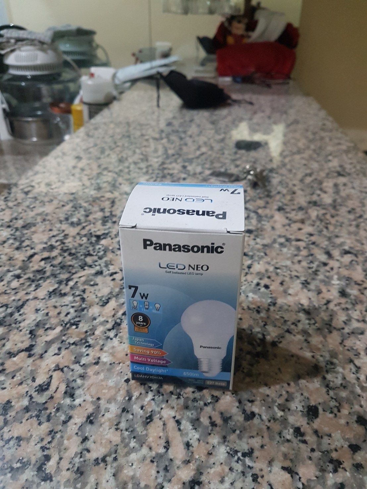
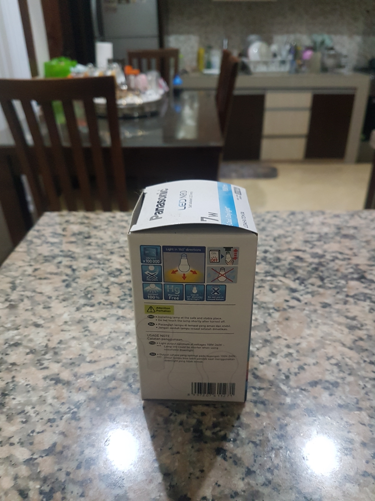
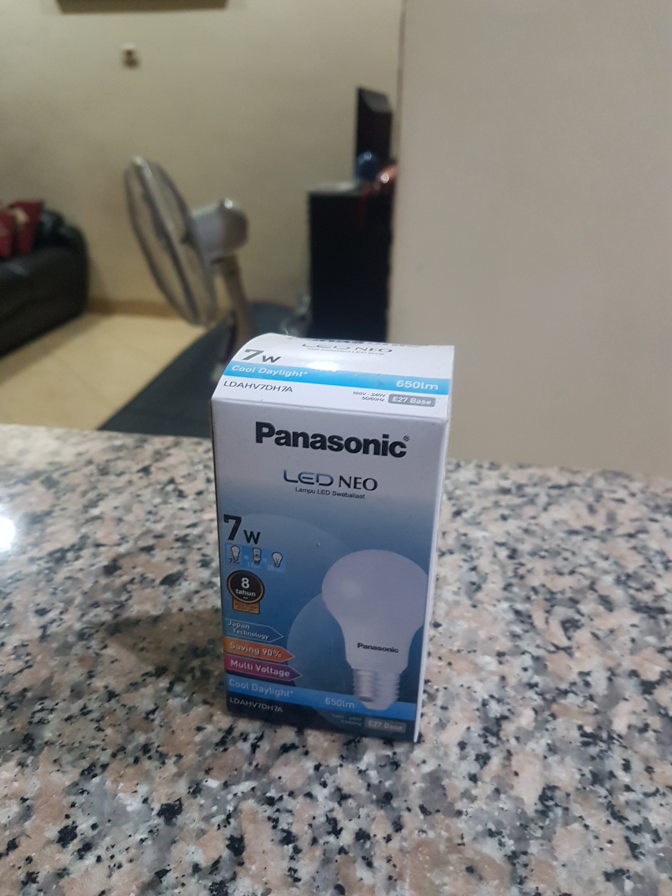
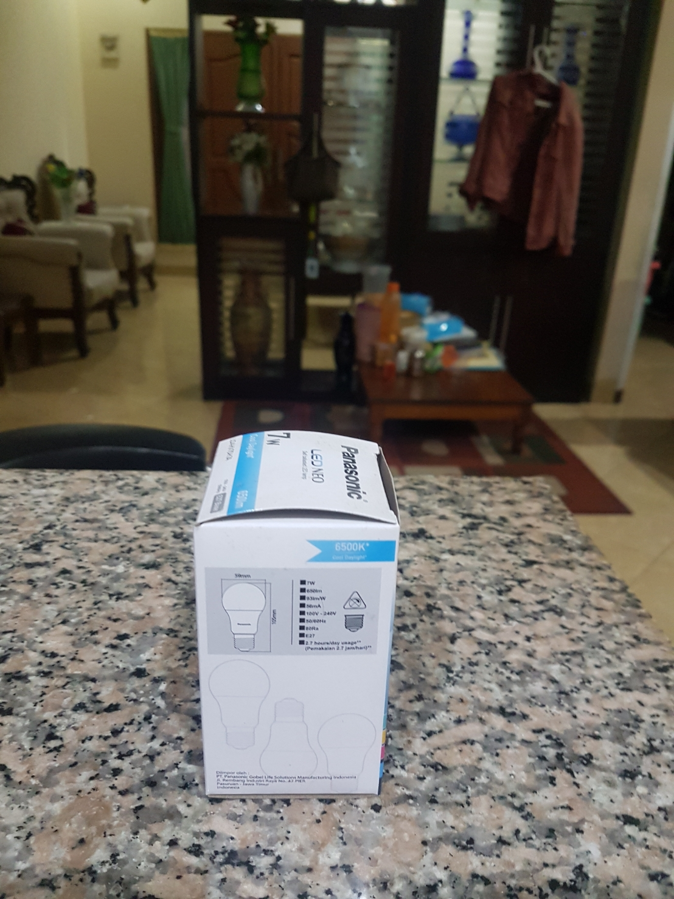

# tugas-1-Erki Kadhafi Rosyid

Identitas diri:

-   Nama: Erki Kadhafi Rosyid
-   NRP: 05111940000050

## Nama Benda

Benda yang saya foto adalah "Kotak Lampu" diawali dengan huruf K.

## Tugas WebGl

Pada tugas 1 kami diminta membuat aplikasi Grafika WebGL berdasarkan gambar yang sudah kami unggah menggunakan 2 sudut pandang yang berbeda. Saya menggunakan tampak depan serta tampak kanan dari gelas tersebut. Hasil dari tugas 1 saya dapat diakses di: [link website](https://upbeat-varahamihira-89d497.netlify.app/)

## Tugas Mencoba ThreeJS

Membuat beberapa objek pada ThreeJS solid dan wireframe dengan material dan lighting berbeda. [link website](https://romantic-easley-064216.netlify.app/)

## Foto Benda

### Tampak depan atas

### Tampak kanan atas

### Tampak belakang atas

### Tampak kiri atas

